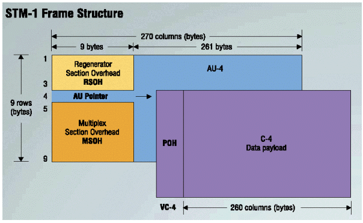

<head>
    
</head>

2015 - Redes de Acceso y Transporte - Respuesta a Preguntas
===

<h2>
    Describa la curva de atenuación vs. longitud de onda. Explique una ventana en este contexto.
</h2>

La longitud de onda define entre otras cosas el color de la luz. La luz es parte del espectro electromagnético como los rayos x, ondas de radio, micro-ondas, radio, tv, teléfonos celulares, y otros tipos de señales inalámbricas. 

Frecuencia y Longitud de Onda están relacionadas. Para radiaciones de longitudes de ondas más angostas como la luz, rayos UV y rayos x, en general las identificamos mediante la longitud de onda. Mientras que radiaciones con longitudes de onda más altas las identificamos mediante el valor de su frecuencia. 

La luz con la cual estamos más familiarizados es evidentemente la luz que podemos ver. Las mismas se encuentran entre los 400 y 700 nanometros y van desde los azules y violetas a los rojos. Este valor corresponde a las emisiones más brillantes emitidas por el sol. En otras palabras desarrollamos nuestra vista para maximizar las emisiones de nuestra estrella local.

Las fibras ópticas de vidrio utilizan la luz en la zona infrarroja, la cual es más larga que las emisiones de luz visibles, que se encuentran alrededor de 850, 1300 y 1550 nm. Utilizamos estas longitudes de onda porque la atenuación sufrida por estas señales es mucho más baja. La atenuación producida en el cristal de la fibra es producida por dos factores: absorción y scattering. Absorción ocurre en longitudes de onda específicas llamadas bandas de agua debido a la absorción por minuto de vapor de agua en el cristal.

Scattering se produce cuando la luz rebota en los átomos o moléculas del cristal. Longitudes de onda más largas sufren mucho menos de los problemas de scattering. La razón de que el cielo es azul es porque la luz del sol sufre más scattering en la banda de los azules.

Las longitudes de onda utilizada para la transmisión por fibra óptica son determinadas por dos factores: longitudes de onda más largas en la banda de los infra-rojos y las longitudes de onda entre las bandas de absorción. Por lo tanto las longitudes de onda utilizadas son 850, 1300 y 1550 nm. Afortunadamente, somos capaces de crear transcievers (lasers o LEDs) y receptores (fotodetectores) sobre estas longitudes de onda.

Aunque los valores de atenuación sobre la fibra son menores sobre longitudes de onda más altas, no las utilizamos porque en estos valores más altos la temperatura ambiente se convierte en ruido de fondo, que interfiere con las señales. Además existen múltiples bandas de agua en las longitudes de onda más altas. 

Fibras ópticas de plástico son hechas con materiales que tienen menor absorción en longitudes de onda más cortas. Por lo tanto utiliza luz roja a 650 nm, aunque los niveles de atenuación son aceptables en longitudes de 850 nm, pudiéndose usar transmisores de fibra de vidrio.
    
La atenuación depende del tipo de fibra y de la longitud de onda utilizada. Si realizamos una gráfica del espectro de absorción de la fibra contra la longitud de onda del láser, ciertas características de la fibra pueden ser identificadas. 
      
Las longitudes de onda utilizadas para telecomunicaciones se encuentran en la zona con menos atenuación. Estos valores son conocidos como “ventana de telecomunicaciones” (telecom Windows). Los picos de atenuación encontrados son producto de la presencia de átomos de hidrogeno e iones de hidróxido dentro de los cables de fibra óptica, los cuales causan un crecimiento en los valores de absorción. Estos iones aparecen cuando moléculas de agua penetran el cable, ya se debido a reacciones químicas producidas durante el proceso de manufactura del cable o debido a la humedad ambiente. Se conoce a estas zonas como zonas de pico de absorción de agua.
    
### Ventanas de Operaciones

Se denomina ventana de operación a las bandas de longitudes de onda que pueden existir en una red de comunicación óptica. Prácticamente, existen tres ventanas de operación: C, L y S. La banda convencional “C” es aproximadamente 1525-1565 nm. Tiene una pérdida de unos 0.2 dB por km. La mayoría de redes metropolitanas o de larga distancia utilizan esta banda. Tiene unos 40 nm y puede acomodar unas 50 diferentes longitudes de onda, cada una de ellas de 100 GHz (o 0.8 nm), o 100 longitudes de onda de 50 GHz. El espacio entre cada una de ellas esta estandarizado y actualmente es 0.8 o 0.4 nm.
    
La banda larga (L) comienza en 1570 nm y se extiende hasta 1620 nm. Tiene un poco más perdidas que la banda C pero características similares. Sin embargo no tiene un gran empuje comercial todavía.
    
Por último, la banda corta (S) se encuentra alrededor de los 1310 nm. Cuenta con una importancia estratégica al estar cerca de la banda de cero dispersión (cerca de los 1300 nm que tiene un valor mínimo de dispersión debido a la cancelación entre la dispersión del material y de las ondas guías). Tiene un valor de perdidas mayor al de la banda C de cerca de 0.5 dB por km. Por lo tanto, no es la mejor solución para implementaciones de largas distancias. 
    
Además de estas bandas podemos encontrar la banda tradicional de 850 nm, utilizada para las primeras transmisiones ópticas. La banda 850-980 nm es más que nada utilizada para implementaciones multi-modo y para LANes cortas. Tiene un nivel alto de pérdidas de entre 2 y 3 dB por kilometro.  

###Atenuación

- Es la reducción de la potencia de la señal óptica a lo largo del medio que la transporta.
- Se mide en dB/km
- Valores típicos:
    + 0.35 db/km a 1330 nm.
    + 0.25 db/km a 1550 nm.
- Producida por imperfecciones e impurezas de la fibra
- La impureza más común son las moléculas oxhidrilos (OH-) que permanecen como residuos del proceso de manufactura.
- También puede ser producida por influencias mecánicas como micro y macro bendings.
- Scattering de Rayleigh
    + Principal mecanismo responsable de la atenuación de la fibra.
    + Se produce cuando la luz encuentra en su camino defectos de la fibra cuyo diámetro es mucho menor que la longitud de onda de la señal, que actúan como objetos que dispersan la luz.
    + Imperfecciones producidas por irregularidades en la densidad del vidrio en el proceso de enfriamiento.
    + Limita la operación a longitudes de onda menores a 800nm.
- Atenuación Intrínseca
    + Debida a imperfecciones e impurezas en la fibra. El fenómeno de absorción hace que la energía de la señal sea absorbida por las impurezas y convertida a calor o energía vibratoria.
    + En la región ultra-violeta ocurre cuando una partícula de luz interactúa con un electrón y lo excita a un nivel de energía más alto.
    + En la región infra-roja se produce debido a la frecuencia de vibración característica de las cadenas atómicas.
- Atenuación Extrínseca
    + Macrobendings: al curvar con un ángulo constante, el índice de refracción varía.
    + Microbendings: Imperfecciones en la geometría cilíndrica de la fibra durante el proceso de fabricación. Es muy localizado y puede no ser claramente visible.

### Dispersión

- Las componentes de distinta frecuencia de una señal viajan a distintas velocidades, por lo que la onda se deforma al atravesar la fibra.
- En fibras multi-modo, también se dispersan componentes de igual frecuencia pero que inciden con ángulos distintos.
- Limita la velocidad máxima a la que transmiten los datos, la distancia máxima o la capacidad de la señal de soportar información.
- Normalmente se mide en ps/nm-km

Disp.Cromática=<dispersión(ps⁄(nm-km))>*<distancia(km)>*<ancho espectral (nm)>
    
- Dispersión Temporal Multi-trayectoria
    + Los rayos que incide con ángulos distintos se propagan a velocidades diferentes.
    + Afecta las fibras multi-modo.
    + Para evitarlas se utilizan fibras de índice gradual.
    + En general las fibras de índice gradual tienen índice de distribución parabólico (el índice decrece en función de la distancia al eje.)
    + Se puede ver que los rayos describen una trayectoria sinusoidal.
    + Las fibras mono-modo no tienen DTM
- Dispersión Cromática
    + Diferentes longitudes de onda de un pulso se propagan a distintas velocidades.
- Dispersión Material
    + El campo eléctrico de una onda electromagnética que se propaga produce polarización en las moléculas del material, de tal manera que la estructura electroníca o la propia molécula oscilan a la frecuencia de la onda, radiando ondas EM de igual frecuencia e interfiriendo con la onda propagada.
    + En consecuencia, las distintas longitudes de onda se propagan a diferentes velocidades en un mismo medio. En otras palabras n=n(λ).
- Dispersión Crómatica
    + Debida a los diferentes índice de refracción del core y el cladding, y de sus dependenciad de la longitud de onda.
    + Los campos eléctrico y magnético que forman parte de un pulso de luz se extienden fuera del núcleo. Esta cantidad que los campos comparten entre el cladding y el núcleo tiene una fuerte dependecia de la longitud de onda.
    + Las longitudes de onda corta están bien confirmadas, lo que hace que el “índice de refracción efectivo” se aproxime al core.
    + Las longitudes de onda más largas penetran más en el cladding lo que hace el “índice efectivo” se aproxime más al del cladding.

<h2>
    Características principales de 802.11 a, b y g. Compárelas.    
</h2>

Los distintos estándares de la IEEE 802.11 difieren principalmente en las velocidades que pueden adquirir, rangos de transmisión y frecuencia utilizada, pero son similares en cuanto a su implementación. Todos los estándares permiten diseños de redes de infraestructura o ad-hoc, y utilizan los mismos protocolos de seguridad.

### IEEE 802.11

Existen realmente dos variaciones iniciales de este estándar. Ambas ofrecen velocidades de transmisión de 1 o 2 Mbps y trabajan en la misma banda de frecuencias: 2.4 GHz. La diferencia entre ellas es en cómo se transmiten los datos a través del espectro. Uno utiliza FHSS, y el otro DSSS. El estándar original es demasiado lento para las velocidades de transferencia que estamos acostumbrados.

### IEEE 802.11a

En términos de velocidad de transmisión, 802.11a ofrece velocidades muy superiores al original, al poder alcanzar conexiones de hasta 54 Mbps trabajando sobre la banda 5.0 GHz. Además permite establecer conexiones a velocidades de 6, 12 o 24 Mbps. Es importante notar que 802.11a no es compatible con los estándares 802.11b y 802.11g. 

### IEEE 802.11b

Este estándar permite velocidades de hasta 11 Mbps. Sin embargo, los dispositivos son diseñados para ser compatibles con los estándares anteriores, que proveen velocidades de 1, 2, y 5.5 Mbps. Trabaja en la banda 2.4 GHz y es compatible con 802.11g. 

### IEEE 802.11g

802.11g es un estándar relativamente popular en la actualidad, ofrece transmisión inalámbrica para enlaces de hasta 40 metros y velocidades de 54 Mbps trabajando en la banda 2.4GHz. 

### IEEE 802.11n

El estándar posterior 802.11n permite incrementar de forma significativa el throughput en las bandas 2.4 y 5.0 GHz. El objetivo de este estándar era alcanzar velocidades de 100 Mbps, pero en condiciones adecuadas es posible conseguir establecer una conexión a 600 Mbps. 

Una de las mejores principales brindada por este nuevo estándar es la utilización de MIMO para la transmisión de los datos. Esencialmente, MIMO utiliza una técnica de multiplexado que permite el envío de múltiples señales sobre el mismo medio para aumentar el ancho de banda. Estas múltiples señales pueden tener la misma información, pero contar con un leve desfasaje que provoque una interferencia constructiva en el destino. Otra forma de utilizarlo es enviando distintas partes del mensaje sobre cada señal, las cuales son unidas en el destino para obtener el mensaje original. Dependiendo de la cantidad de señales en simultáneo que se utilicen se puede multiplicar en gran escala la velocidad de transmisión. Para poder utilizar esta funcionalidad, es necesario que tanto en el emisor como en el receptor contemos con múltiples antenas. 

Otras de las mejoras más importantes que trajo 802.11n a la mesa fue la posibilidad de utilizar más de un canal para el envío de los datos. Al utilizar más canales para la transmisión, se puede multiplicar la información enviada de gran manera.

Por último, 802.11n utiliza OFDM para el envío de los datos. Esto es, se utilizan sub-portadoras dentro de los canales para transmitir la información.

<h2 id="detalle_las_caracteristicas_basicas_de_la_tecnología_wimax">
    Detalle las características básicas de la tecnología WiMAX. 
</h2>

WiMax es una tecnología inalámbrica diseñada para proveer la “ulitma milla” de acceso a servicios de banda ancha a clientes de una determinada área geográfica. No requiere línea de vista con la estación base, por lo que permite conectividad con múltiples dispositivos móviles dentro de un radio de entre 3 y 10 kilomentros.

Está definido por el WiMax Forum y publicada en el estándar IEEE 802.16. Aunque el funcionamiento de WiMax parezca similar al de 802.11, los mismos son incompatibles. Para empezar, operan en bandas distintas: WiMax opera en las bandas licenciadas 2 y 11 Ghz mientras que 802.11 trabaja en las bandas 2.4 y 5.0 GHz.

WiMax también permite trabajar en situaciones con línea de vista, utilizando antenas punto a punto con posibles platos reflectores. Estas conexiones en general son establecidas en bandas de frecuencias más altas que en situaciones nLOS, las cuales pueden llegar a ser de hasta 66 GHz. 

En la capa física, WiMax utiliza OFDM. Este esquema le permite operar en situaciones nLOS, dado que ofrece buena resistencia a transmisiones “multi-path”. Además soporta operar sobre un esquema TDD o FDD (full o half dúplex).

Se pueden alcanzar altas velocidades utilizando WiMax, las cuales pueden alcanzar los 74 Mbps sobre canales de 20 Mhz. Sin embargo es más usual utilizarlos sobre canales de 10 MHz, operando con TDD con un esquema 3 a 1 entre la bajada y la subida. El valor de throughput pico en la capa física ronda los 25 Mbps para la bajada y 6.7 Mbps para la subida.

Es capaz de adaptar rápidamente su velocidad de transmisión de manera de aprovechar el ancho de banda del canal disponible. Por ejemplo, puede utilizar FTTs de 128, 512 o 1048 bits dependiendo si el canal tiene un ancho de banda de 1.25, 5 o 10 Mbps respectivamente. Esta funcionalidad puede ser de suma utilidad si el cliente está haciendo roaming entre distintos servicios que cuentan con distintos anchos de bandas configurados.

Otra de las funcionalidades interesantes de WiMax es que se puede configurar para brindar confiabilidad en el envió al enlace. Esto se logra forzando el acuse de recibo de los mensajes enviados sobre la capa de enlace. Si algún mensaje se pierde durante la transmisión este se reenvía para garantizar su transporte utilizando ARQ.

Permite alocar distintos recursos por usuario. Tanto la subida como la bajada puede configurarse desde la base. La capacidad es compartida entre múltiples usuarios a demanda, pudiéndose utilizar un esquema TDM.

Una característica fundamental de WiMax es que permite arquitecturas orientadas a la conexión. Esto es de sumo interés para determinadas aplicaciones de voz y multimedia. Se pueden definir conexiones con bit rate constante, bit rate variable, flujos de datos a tiempo real, así como tráfico best-effort. Está diseñado para soportar múltiples usuarios, donde cada uno tiene sus propias políticas de QoS. Soporta movilidad implementando hand-overs seguros entre distintas células. Toda la arquitectura esta implementado sobre IP.

<h2>
    Explique los conceptos de FEXT y NEXT.
    ¿Cuál de ellos tiene más importancia en ADSL? Fundamente la respuesta.        
</h2> 

Crosstalk sobre cables UTP es causado por las señales que pasan por un par de cobre que generan ruido sobre las señales en el otro par. Este ruido generado entre pares puede ser un factor límite para el rendimiento del enlace. 

Crosstalk puede ocurrir de dos maneras: Near End Cross Talk o Far-end Cross Talk, ósea, al comienzo o al final de la línea. El primero ocurre cuando la señal de un transmisor en una punta interfiere con el receptor de la misma punta. Mientras que el segundo ocurre cuando la señal interfiere con un receptor del otro extremo de la línea.

El Cross Talk es generado por las componentes capacitivas e inductivas generadas al circular una señal por un par de cobre. NEXT es la suma de todos los Cross Talks generados por señales que viajan con una dirección opuesta a la señal siendo interferida. Por otro lado FEXT es el conjunto de Cross Talks generados por todas las señales que viajan en la misma dirección que la señal interferida. El receptor afectado en la primera es el que esta del mismo lado que el transmisor, mientras que en la segunda el afectado es el que está al final de la línea. 

En general FEXT es mucho menor que NEXT en sistemas DSL, dado que el FEXT es atenuado a medida que atraviesa el cable. Sistemas como ADSL y VDSL utilizan FDD para minimizar el efecto de NEXT. Sin embargo, sigue siendo un problema en estos sistemas cuando se aparean con otros que utilicen la misma banda de frecuencia como HDSL, SDSL, etc.

Dependiendo de la topología utilizada los problemas generados por NEXT pueden variar. Por ejemplo, del lado del consumidor los efectos del NEXT son atenuados debido a la distancia que existe entre ellos. Sin embargo si existe un repetidor cerca de alguno de los abonados esta atenuación desaparece y puede traer resultados muy negativos para aquel que este cerca.

<h2>
    Explique para qué sirve el label en MPLS. Detalle los campos que lo componen.
</h2>

Cuando un paquete atraviesa una red desde un router a otro, cada router toma una decisión de forwarding completamente independiente para ese paquete. Esto es, cada router analiza el encabezado del paquete, y cada router corre algún algoritmo de ruteo. El router decide de forma independiente el siguiente salto de este paquete, basado en el análisis de su encabezado y de la información existente en su tabla de ruteo, generada por algún algoritmo de ruteo.

Los paquetes IP contienen considerablemente más información de la necesaria para seleccionar el próximo salto. Por lo tanto la elección de este salto puede verse como un proceso de dos etapas. La primera parte todo el sub-conjunto de posibles paquetes en distintas clases de equivalencias conocidas como “Forwarding Equivalent Classes” (FECs). La segunda mapea cada FEC a un siguiente salto. En lo que respecta a la decisión de fowardeo, las diferencias que puedan llegar a tener los paquetes agregados dentro de la misma clase son irrelevantes. Todos los paquetes pertenecientes a una misma FEC y que viajen desde un mismo nodo seguirán el mismo camino.

El protocolo IP convencional asigna dos paquetes distintos a una misma FEC si existe un prefijo de dirección “X” en la tabla de ruteo, tal que “X” corresponda al prefijo más largo, “longest prefix match”, de la dirección de destino de cada paquete. A medida que los paquetes atraviesan la red, cada nodo re-examina el paquete y la vuelva a asignar a una FEC.

En MPLS, la asignación de un paquete a una determinada FEC es realizado una única vez durante su camino. La FEC a la cual es asignado el paquete es fijado con un valor corto conocido como “label” o etiqueta. Cuando un paquete es enviado al siguiente salto, la etiqueta es enviada con él, esto es, los paquetes son etiquetados antes de ser enviados.

No es necesario procesar nuevamente el encabezado del paquete una vez que fue etiquetado, en cada nodo intermedio. En cambio, la etiqueta es utilizada como un índice dentro de una tabla que indica el siguiente nodo de la ruta de ese paquete, y una nueva etiqueta. La vieja etiqueta es reemplazada por la nueva, y el paquete es luego enviado al siguiente salto.

Dentro del paradigma de MPLS, una vez que un paquete es asignado a una FEC, no es necesario realizar este análisis nuevamente en los routers sub-siguientes. Todo el ruteo del mismo se realizara a través de las etiquetas. Esto tiene una cantidad de ventajas con respecto a métodos tradicionales de forwarding.

- MPLS puede ser realizado por switches, que sepan interpretar etiquetas “MPLS” pero no sean capaces de interpretar los encabezados capa 3.
- Como el router de ingreso es el que selecciona la etiqueta, puede tomar una decisión de que etiqueta colocarle en base a cualquier parte del encabezado IP, o de variables adicionales como por ejemplo: la interfaz de entrada.
- Un paquete que ingresa a la red a través de un router puede ser asignado una etiqueta distinta a la que recibiría si entrara por otro router.
- El método utilizado para la asignación de la etiqueta inicial puede hacerse más complejo, sin que esto tenga impacto alguno en los demás equipos.
- A veces es de interés forzar al paquete para que siga una ruta determinada. Esto puede lograrse utilizando MPLS con facilidad mientras que en redes con ruteo tradicional es más complejo.
- La etiqueta de MPLS puede también utilizarse para inferir el tipo de QoS que aplicar a un determinado paquete. Por lo tanto una etiquete puede no solo indicar la FEC a la que pertenece ese paquete sino la calidad de servicio que tiene asignada.
    
La razón por la cual se denomina “Multiprotocol Label Switching” es porque se puede implementar por debajo de cualquier protocolo de red, no solamente IP.

Una etiqueta es un identificador corto utilizado para identificar una FEC o Forwarding Equivalent Class. En general un paquete es asignado a una determinada FEC dependiendo de la información contenida en la dirección de destino dentro del encabezado del protocolo de red.

Si dos routers RU y RD hablan MPLS, pueden coordinarse de manera que cuando RU transmita un paquete hacia RD, RU va a etiquetar dicho paquete con la etiqueta L si y solo si ese paquete es miembro de una FEC particular F. Esto es, pueden crear una correspondencia entre la etiqueta L y la FEC F para paquetes moviéndose de RU a RD. El resultado de esta coordinación es que L se transforma en la etiqueta de salida que identifica los paquetes de la FEC F en RU, y L se corresponde en RD a los paquetes entrantes que representan la FEC F.

Es importante notar que L no necesariamente representa la FEC F para todos los paquetes, excepto para aquellos que son enviados desde RU a RD. L es un valor arbitrario cuyo significado con respecto a la FEC F es local a los routers RU y RD.

Cuando hablamos de paquetes enviados desde RU a RD, no queremos decir que el originador del paquete es RU y el receptor es RD de forma implícita. Simplemente es una forma de identificar los paquetes de tránsito en uno o ambos routers.

<h2>
    ¿Cuál es la utilidad del protocolo ICMP?
</h2>

El protocolo IP es utilizado para comunicaciones entre hosts en redes de datagramas. Los dispositivos que conectan estas redes son llamados Gateways. Los mismos se comunican entre sí por razones de control mediante protocolos Gateway to Gateway (GGP). Ocasionalmente estos Gateways pueden comunicarse con un host de origen, por ejemplo para reportarle un error ocurrido en el procesamiento de un datagrama. Para estos propósitos existe el protocolo ICMP (Internet Control Message Protocol). ICMP utiliza IP para su funcionamiento e interactúa con el como si fuera un protocolo de nivel superior. Sin embargo, ICMP es una parte fundamental para el funcionamiento de IP, y debe estar implementado en todo módulo IP.

Mensajes ICMP pueden ser enviados en diversas situaciones: por ejemplo, cuando un datagrama no puede llegar al destino; cuando el gateway no tiene capacidad en su buffer suficiente para fowardear el datagrama; o cuando el gateway es capaz de dirigir al host para que envíe su tráfico por una ruta más eficiente.

IP no fue diseñado para ser un protocolo absolutamente confiable. El propósito de estos mensajes de control es proveer feedback sobre los problemas encontrados en ambientes de comunicación; no hacer IP confiable. La utilización de estos mensajes no implica garantía en el envío de los datagramas, o el retorno de un mensaje de control. Algunos datagramas continuarán siendo perdidos sin reportes de su perdida. Protocolos superiores a IP deben implementar estas funcionalidades en caso de que la confiabilidad en el envío sea necesaria.

Los mensajes ICMP típicamente reportan errores en el procesamiento de datagramas. Con el fin de evitar loops infinitos, no se envían mensajes de error sobre los mensajes ICMP. Además, estos mensajes solo se envían cuando refieren a datagramas correspondientes al fragmento 0 en caso de tratar con datagramas fragmentados.

<h2>
    Indique en qué casos se envía el mensaje de tiempo excedido, a qué tiempo excedido se refiere el mismo y cómo es el funcionamiento de los mecanismos de contadores o vencimiento de tiempo en el protocolo correspondiente. Explicar.
</h2>

Si el Gateway que está procesando el datagrama encuentra que el campo “Time to Live” (TTL) es cero, lo debe descartar. En este caso el Gateway debe notificar al host de origen a través de un mensaje de tiempo excedido.

Si un host que está reconstruyendo un datagrama fragmentado y no puede completar su rearmado debido a fragmentos perdidos dentro del tiempo límite debe descartar el datagrama, y puede enviarle un mensaje al host de origen indicando el error a través de un mensaje de tiempo excedido. En el caso de que el fragmento cero no esté disponible, ningún mensaje tiene porque ser enviado.

El protocolo IP implementa dos funciones básicas: direccionamiento y fragmentación. 

Los módulos de Internet usan direcciones transportadas en su encabezado internet para transmitir datagramas a sus destinatarios. La selección del camino para la transición se denomina “routing”. Estos módulos utilizan además campos en el encabezado de internet para fragmentar y re-ensamblar datagramas, según sea necesario transmitir en redes de “pequeños paquetes”.

A nivel de operación, dentro de cada host y gateway conectado a internet reside un módulo de Internet. Estos módulos comparten reglas comunes para la interpretación de los campos de dirección, y para la fragmentación y re-ensamblado de los paquetes. Además, estos módulos (en especial dentro de los Gateways) cuentan con procedimientos que les permiten tomar decisiones de ruteo, entre otras cosas.

IP trata cada datagrama como una entidad independiente, no relacionada con ningún otro datagrama de la red. No existe el concepto de conexión o de circuitos virtuales (ya sean virtuales o de cualquier otra índole.)

Utiliza cuatro mecanismos principales para proveer sus servicios: Tipo de Servicio, Tiempo de Vida, Opciones, y Checksum de Encabezado.

El Tipo de Servicio se utiliza para identificar la calidad del servicio deseado. Es un concepto abstracto o un set de parámetros generales que caracterizan las opciones de servicio brindadas por las redes conectadas a internet. Es utilizado por los Gateways para seleccionar los parámetros de transmisión dentro de una determinada red, la red a utilizar para el siguiente salto, o el próximo Gateway al momento de rutear un datagrama.

El Tiempo de Vida de un datagrama es una indicación del límite superior de su vida dentro de la red. Es configurado por el host de origen y disminuido en cada uno de los puntos donde es procesado. Si su valor llega a cero en algún nodo, antes de llegar a su destino, el datagrama es destruido. Por lo tanto, el Tiempo de Vida de un datagrama puede pensarse como un mecanismo de auto-destrucción en un tiempo límite.

Las Opciones permiten implementar funciones de control necesarias en algunas ocasiones pero no generalmente. Incluyen la posibilidad de proveer timestamps, seguridad y opciones especiales de ruteo.

El campo de checksum provee verificación de que la información utilizada durante el procesamiento del datagrama se transmitió correctamente. La misma puede llegar a contener errores. No existe control de los errores en la información, solo en el encabezado. No existen retransmisiones no controles de flujo.

La detección de un error puede ser comunicada a través de mensajes ICMP, el cual debe estar implementado en todo módulo de Internet.

<h2>
    Indique qué tipos de redes de acceso de cobre conoce y cuáles son las ventajas y desventajas de cada tipo.
</h2>

Existen varios tipos de redes de acceso basadas en cobre. Se denominan con la sigla xDSL, donde DSL significa “Digital Subscriber Line” y la x corresponde a alguna de las variables existentes (HDSL, ADSL, VDSL, etc.) El beneficio principal que proveen todas estas redes es que son capaces de operar sobre la red de cobre existente, utilizada para la telefonía.

La razón por la cual existen tantos tipos de redes DSL es porque las necesidades para el acceso a Internet varían de gran manera de pendiendo del caso. Las necesidades que tiene un hogar que cuenta con una o dos computadoras es bastante distinta a la que puede tener una empresa.

Algunas de las diferencias principales que se pueden encontrar son las siguientes:

- Velocidad – Que tanta información se puede enviar en un determinado período de tiempo. Generalmente se mide en bps (bits por segundo).
- Codificación de la Línea – Como se codifica la información para ser enviada por el medio físico. Existen numerosas maneras de codificar la información.
- Número de líneas – Cantidad de pares de cobre que requiere la solución.
- Distancia Límite – Cuantos metros puede recorrer la señal de forma confiable.

### HDSL

High-bit-rate Digital Subscriber Line, es la versión más madura de xDSL. Fue desarrollada en los 80’ como una alternativa para el los estándares T1 de esa época. Estas líneas fueron desarrolladas e implementadas para la transmisión de datos de alta velocidad. Son líneas dedicadas, tendidas desde el proveedor de servicio hasta el consumidor. Usualmente son bastante costosas, por lo que una alternativa basada en HDSL no solo es más efectiva sino que es notoriamente más económica.

Uno de los problemas que tienen los T1 es que las líneas deben ser pre-condicionadas para contar con ciertos requerimientos para su correcto funcionamiento. HDSL fue diseñado para ser capaz de compensar las condiciones de la línea. Además su distancia de funcionamiento es casi el doble, permitiendo conexiones a unos 6 km de distancia.

Otra de las mejoras significativas con respecto a T1 es que la conexión es dúplex, a diferencia de los T1 que solo permitían conexiones simplex. Esto es posible utilizando una técnica llamada “cancelación de eco”. Utilizando esta técnica podemos enviar información en ambas direcciones sobre la misma banda de frecuencias en la misma línea. La utilización de bandas de frecuencia más pequeñas ayuda a reducir las pérdidas por NEXT (Near-End Cross Talk).

Como codificación de línea, HDSL utiliza 2B1Q (two binary one quaternary). Básicamente, se utilizan cuatro niveles de voltaje de la señal, que representan cuatro símbolos distintos. Es muy sencilla de implementar y no sufre de gran manera por NEXT. Sin embargo, no utiliza de forma óptima en ancho de banda disponible en el canal como lo hacen algunas otras soluciones.

La principal ventaja de HDSL es que es una tecnología madura y probada en el mercado. Es capaz de alcanzar velocidades de transmisión decentes a través de dos pares de cobre de hasta 1.544 Mbps. 

El problema es justamente este último punto: requiere de dos pares trenzados de cobre para funcionar lo cual incrementa los costos de implementación. Además, HDSL no soporta Plain Old Telephone Service o POTS, en la misma línea que los datos. Es necesario contar con líneas adicionales dedicadas a este servicio. Otra desventaja es que las velocidades de otras formas de DSL son superiores a las de HDSL.

### ADSL

Asymmetric Digital Subscriber Line, deriva su nombre del hecho de que la velocidad de transferencia de bajada es muy superior a la de subida. En general es hasta diez veces más rápida.

Originalmente fue desarrollada para compañías de telefonía que quisieran proveer aplicaciones de video por demanda. Para poder hacer esto, necesitarían enviar grandes cantidades de información a los clientes y no necesitarían demasiado tráfico en la otra dirección. Actualmente el foco de ADSL ha cambiado. Ahora se utiliza como red de datos para el acceso de banda ancha a Internet. El tráfico de Internet es en general también asimétrico, por lo que ADSL funciona muy bien en este ambiente, hasta el punto de ser utilizado en la gran mayoría del mercado.

Las velocidades de transmisión que ADSL es capaz de alcanzar depende de la distancia desde las oficinas centrales (CO) y las instalaciones de los clientes (CPE). A una distancia de unos 3 km, es capaz de alcanzar velocidades de 8 Mbps de bajada, mientras que a 6 km solo puede conseguir velocidades de 1.544 Mbps. La subida máxima es de 640 Kbps y escala de la misma forma que la bajada.

Fue diseñado para coexistir con servicios POTS sobre la misma línea. POTS opera en frecuencias de hasta 4 kHz, por lo tanto ADSL tiene que funcionar en frecuencias superiores. Usualmente entre 30 kHz y 1.1 MHz. La utilización de bandas de frecuencias distintas para el envío de voz y datos hace que se puedan recuperar ambas señales con la utilización de filtros apropiados. En ADSL se llama POTS splitters. Estos toman ambas señales y las separan para que trabajen en ambas redes sin interferirse entre sí. Cuentan con algunos problemas técnicos. Por ejemplo, es necesario que los proveedores de servicio tengan que enviar personal capacitado para su instalación.

Con respecto al esquema de codificación de datos utilizado por ADSL, se utiliza modulación DMT (Discrete MultiTone Modulation) o CAP (Carrierles Amplitude Phase Modulation).

En DMT se divide el espectro en 256 subcanales de unos 4 kHz cada uno, de los cuales 32 se utilizan para la subida y los demás para la bajada. Cada canal envía datos de forma independiente utilizando QAM. Este último es un método de codificación similar a 2B1Q pero permite además de representar un símbolo por la amplitud de la señal, utilizar la fase de la señal. 

El ruido en la línea estará presente en todos los canales con distintos niveles de potencia. Para disminuir el efecto negativo provocado por el ruido, cada uno de los sub-canales puede negociar un esquema de QAM distinto que utilice una constelación más sencilla en aquellos canales más afectados. En general el ruido en frecuencias altas suele no ser muy importante por lo que se pueden utilizar constelaciones más grandes.

Una de las desventajas que presenta DMT es que los canales de subida pueden producir NEXT en los canales de bajada más cercanos. Se pueden apagar estas bandas para evitar este problema pero esto afecta de gran manera el ancho de banda de la solución.

Es una solución excelente para aplicaciones residenciales. Utiliza las líneas existentes y convive pacíficamente con la solución de telefonía fija implementada. También es ideal para pequeñas y medianas empresas dado las altas velocidades de bajada que puede alcanzar (8 Mbps). 

Sin embargo, las bajas velocidades de subida pueden no ser suficientes para empresas de gran porte, o aquellas que tengan necesidad de publicar servicios en Internet. También al sufrir tanto con respecto a la distancia, hace que sea imposible de implementar en algunas situaciones. 

### VDSL

VDSL significa Very-high-bit-rate Digital Line Subscriber. Es capaz de conseguir establecer conexiones a 13, 26 o 52 Mbps. 

Algunos proveedores de servicio que deseen extender su red de acceso de fibra hasta los consumidores a veces se ven inhabilitados por los altos costos implicados. La última milla del cableado solo sirve a un grupo reducido de clientes. VDSL fue diseñado para ser utilizado en estos casos. Por ejemplo, los cables de fibra óptica pueden llevarse hasta una ubicación cercana a los abonados, y después se puede realizar la conexión final a través de VDSL. Como las distancias son cortas, es posible alcanzar estas altas velocidades.

Está claro que en situaciones donde las distancias no sean tan cortas, la implementación de VDSL se hace impracticable.

<h2>
    Detalle las características que debe tener una red de transporte.
</h2>

Las redes de comunicaciones cuentan con dos componentes principales: redes de transporte y redes de acceso. En cada uno de estos segmentos, varias tecnologías de redes cableadas e inalámbricas se combinan para soportar los servicios de la red. Aunque todavía los servicios de voz son el principal negocio de los proveedores de servicio, las redes de datos continúan tomando popularidad, transformándose en una parte cada vez más importante del negocio.

Al día de hoy, la mayoría de los proveedores de servicio tienen basadas su redes en Synchronous Optical Network/Synchronous Digital Hierarchy (SONET/SDH). Las redes de voz y datos comparten esta estructura, la cual es realizada sobre cables de fibra óptica y la cual se encuentra saturada en cierta medida.

Por otro lado las redes de acceso son aquellas que existen entre el proveedor de servicio y el consumidor a nivel local. En muchos países, esta red está basada predominantemente en tendidos de cobre punto a punto, resultando en una relativa red inflexible y relativamente poco confiable, construida en su momento para soportar servicios de voz y bajas velocidades de transmisión.

Estos servicios del lado del cliente son terminados en equipos especiales del lado del proveedor de servicio que los agregan para luego introducirlos en la red de transporte. Por ejemplo, se podría brindar servicios de acceso a Internet por banda ancha a través de servicios de DSL, los cuales permiten establecer altas velocidades de conexión a través de pares de cables trenzados de cobre, utilizados usualmente para brindar servicios de telefonía. Del lado del proveedor de servicio se colocaría un equipo especial llamado Digital Subscriber Line Access Multiplexer o DSLAM, que permite terminar múltiples servicios DSL. Todos ellos serán multiplexados y colocados en conexiones de alta velocidad para introducirlos al Backbone de la red.

En su sentido más amplio, podemos decir que una red de transporte es un conjunto de facilidades y equipamientos que transportan información entre los elementos de la red (Network Elements o NE) que switchean o rutean el tráfico de los clientes hacia y desde la red de transporte. Esta red tiene la responsabilidad de la entrega correcta y confiable de los datos del cliente. Esto es una sobre-simplifiación. A medida que las redes de transporte crecen es importante que cuenten con sistemas asociados de Administración, Mantenimiento y Aprovisionamiento. De otra manera, sería imposible conseguir una red de transporte confiable en el envío de datos. Es por eso por ejemplo, que Ethernet no es utilizado al día de hoy dentro de las redes de transporte, a menos que sean en alguna aplicación puntual.

Al comienzo las redes de transporte fueron construidos con enlaces punto a punto de cobre, dedicados para el transporte de voz. Está topología fue quedando obsoleta rápidamente. Se vio claramente la necesidad de multiplexar los servicios de manera de poder mandar más de una comunicación por un mismo canal.

Una forma tradicional de clasificar una red de transporte es en relación a su tamaño geográfico. La red de acceso es la sección de la red que conecta los subscriptores a los equipos de switching de borde de la red. La red metropolitana es aquella que conecta las oficinas centrales con las distintas zonas urbanas. Las oficinas centrales usualmente están directamente conectadas a las redes de acceso y a las redes de largas distancias. En general estos CO pertenecen al mismo proveedor de servicios y puede utilizarse uno solo para proveer todos los servicios, o múltiples con o sin alta disponibilidad. La distancia entre COs son generalmente cortas y son en general las encargadas de realizar la interconexión con otros COs, Internet y Gateways internacionales. 

En general los enlaces de mayor velocidad son utilizados para el core de la red. Sin embargo, a medida que pasa el tiempo el costo de utilizar esta tecnología disminuye, pudiéndose implementar en las redes metro. Esto es un comportamiento deseado, ya que cuando más homogénea sean las redes, disminuye la complejidad y por lo tanto los costos de administración.

Con el fin de simplificar el trabajo con las redes de transporte, las mismas se separan usualmente en tres capas de abstracción distintas: Datos, Control y Administración. La primera consiste de los medios de transporte de datos (cobre, fibra, radio, etc.), las porciones de los NEs que multiplexan e inter-comunican los datos. En otras palabras, el plano de transporte provee la canalización por donde el tráfico del cliente fluye de un punto a otro. El plano de control es una combinación del sistema de soporte y operación centralizado y las funcionalidades de los NE que permiten el aprovisionamiento del plano de transporte. Por ejempo, el sistema de señalización 7 (SS7), utilizado para el establecimiento de comunicaciones de voz, es un ejemplo del plano de control.

<h2>
    ¿Qué tipos de fibra óptica conoce?. Describa sus características. Mencione ejemplos de aplicaciones en donde cada tipo resulta conveniente.
</h2>

Un cable de fibra óptica es un filamento muy fino de cristal capaz de transportar información en forma de luz. Estos hilos de cristal están cubiertos de una capa protectora de plástico.

Los cables de fibra óptica cuentan con dos partes fundamentales, el core y el cladding. El core, está construido de cristal y corresponde al área de transmisión de información. A veces el cristal es dopado con algún otro elemento con la intención de modificar su índice de refracción y por lo tanto la velocidad sobre el cable.

El cladding es la capa que recubre al core. La diferencia del índice de refracción entre ambas partes es menor a 0.5%, siendo el del core más alto que el del cladding. De esta manera la luz cuando golpea al cladding, rebota, quedando atrapada dentro del cable, viajando en la dirección deseada. Existe una capa final que recubre al cladding para agregarle un grado adicional de protección.

Las fibras vienen en diferentes configuraciones, cada una útil para una aplicación particular. Los primeros diseños de fibras, multi-modo y mono-modo, siguen siendo utilizados al día de hoy. Existen también otros tipos de fibra como:

- Non Zero Dispersion Fiber (NZDF)
- Zero Water Peak Fiber (ZWPF)
- 10-Gbps laser Optimized Multimode Fiber (OM3)
- Fibras diseñadas para implementaciones sub-marinas

Las diferencias entre estos tipos de fibras recaen sobre variaciones en el rango y número de longitudes de onda, canales en los cuales la luz es recibida, o las distancias que pueden atravesar esas señales sin necesidad de que sean regeneradas o amplificadas, y las velocidades a las cuales pueden viajar.

Dos parámetros principales que impactan en el rendimiento de la fibra son la atenuación y la dispersión. Atenuación es el efecto de degradación de la potencia de la luz a medida que viaja por el canal. Es producida por problemas de absorción y scattering, y es usualmente expresada en dB o en dB/km. La atenuación limita la distancia del enlace, sin necesidad de introducir equipamiento electrónico adicional. Dentro de las curvas de atenuación de la fibra se pueden representar tres ventanas distintas, las cuales disminuyen los efectos de atenuación y residen dentro de un rango de longitudes de onda, que tecnológicamente pueden ser utilizadas para maximizar el envío y la recepción de señales de luz.

- 850 nm primera ventana
- 1310 nm segunda ventana
- 1550 nm tercera ventana

La dispersión es inversamente proporcional al ancho de banda, que corresponde a la capacidad de transporte de información de la fibra, e indica las limitaciones del desplazamiento del pulso de la fibra. Problemas de dispersión cromática ocurren en las fibras multi-modo debido a que los distintos colores de la luz viajan a distintas velocidades. Esto provoca que el pulso dentro de la fibra se ensanche durante su camino. Similarmente, en fibras multi-modo se produce dispersión debido a la geometría de la fibra. Loe múltiples modos del láser se separan en la interfaz de la fibra, los cuales se propagan simultáneamente, ensanchando el tamaño del pulso. Si los pulsos se ensanchan demasiado, puede sobreponerse, haciendo imposible la detección de la señal en el destino. 

Las fibras multi-modo fueron las primeras en comercializarse. Su nombre refiere simplemente a los numerosos modos o rayos de luz que son enviados simultáneamente sobre la longitud de onda guía. Los modos se crean porque la luz solo se propagara sobre la fibra en ángulos discretos dentro del cono de aceptación. Estas fibras cuentan con un core más grande que las fibras mono-modo, permitiendo un mayor número de modos dentro del mismo. Su tamaño hace que sean más sencillas de conectar. Pueden ser categorizadas como step-index o graded-index.

Step-index, o fibras de paso fueron las primeras diseñadas. Sin embargo son demasiado lentas para la mayoría de los usos convencionales debido a sus altos valores de dispersión causada por los distintos caminos de sus modos. 

Fibras Graded-Index o de índice-certificado, cuentan con variaciones en la composición del cristal que compensan los distintos caminos de los modos, disminuyendo los problemas de dispersión. 

Los cables de fibra óptica transportan las señales dentro de las primeras dos ventanas de atenuación. Son capaces de transportar velocidades de 10 GE a distancias entre 300 y 100 metros. 

Fibras mono-modo, sufren en mucho menor medida de problemas de atenuación que las fibras multi-modo y mantiene una mejor fidelidad en el pulso de luz al no sufrir problemas de dispersión causado por múltiples modos. Por lo tanto, puede alcanzar transmisiones de mayor distancia. 

Los núcleos de estas fibras son tan estrechos que solo permiten que viaje un solo rayo de luz. Utilizan la segunda y tercer ventana de transmisión, donde los efectos producidos por la atenuación son mínimos. 

<h2>
    Describa las 3 mejoras fundamentales que tiene el NG-SDH respecto al SDH.
    ¿Estas mejoras la hacen adecuada para el transporte de datos?
</h2>

Algunas de las mejoras provistas por SDH durante su concepción fueron las siguientes:

- Altas velocidades de transmisión
    + Se pueden alcanzar velocidades de hasta 40 Gbps.
- Simplificación en el add and drop
    + Es muy sencillo agregar canales de menor ancho de banda así como extraer canales. No es necesario demultiplexar y luego multiplexar de nuevo la estructura.
- Alta disponibilidad y capacidad
    + SONET permite a los proveedores de servicio reaccionar rápidamente ante cambios en su red. Los “Network Elements” son estándar y pueden ser monitoreados desde una ubicación central.
- Confiabilidad
    + Cuenta con múltiples funcionalidades de back-up así como mecanismos de reparación.
- Escalable hacia el futuro en nuevas tecnologías
    + Es la plataforma ideal para brindar una gran gama de servicios como POTS, ISDN, comunicación de datos, etc.
- Interconexión
    + SONET permite montar Gateways entre redes con facilidad para conectar distintos proveedores de servicio y sistemas SDH. Además, las interfaces SONET son estándares por lo que se pueden combinar equipos de múltiples vendors. 

Las redes SONET Pueden considerarse utilizando un modelo de capas. En la más inferior, denominada capa física, la cual representa el medio de comunicación, tenemos fibra óptica o enlaces de radio satelitales. La capa de sección, representa el camino entre regeneradores. Dentro de esta capa se genera el overhead adicional para conseguir sincronización. Por encima de esta capa tenemos la capa de línea. La misma cubre los enlaces entre los multiplexores. Los módulos de transporte son los encargados de mover el payload entre nodos. Dentro del payload podemos encontrar múltiples señales, cada una con un mapeo distinto. Por “mapeo”, nos referimos al proceso necesario para que señales tributarias como DSn y ATM se adapten a módulos de transporte SONET. Por último, tenemos la capa donde encontramos la aplicación de la red SONET.
 
### Diferencia entre SDH y SONET

SDH significa Synchronous Digital Hierarchy. Es la tecnología de sincronización utilizada en todo el mundo menos USA, Canada y Japon. El desarrollo de esta contraparte internacional se dio pocos años despues de la introducción de SONET. Las diferencias principales entre ellas son los diferentes bit-rates asincronos que deben ser mapedos en ellos. Durante el desarrollo de estas dos tecnologías, se hizo evidente la necesidad de interconectarlas.

Dado que la velocidad máxima utilizada en USA es de 45 Mbps, 51 Mbps fue un mux-rate de sincronización primario suficiente para virtualmente cualquier aplicación SONET. Sin embargo, en el resto del mundo, donde velocidades de 140 Mbps múltiplexadas son muy comunes, se decidio utiliza 155 Mbps como el mux-rate primario. 

Se puede verificar en una tabla que los puntos de transición entre SDH y SONET son posibles. El matcheo es relativamente sencillo, y solo se deben realizar ligeros ajustes para resolver ciertos incidentes generados en el overhead.

### Next Generation SONET/SDH

SONET/SDH es la tecnología más economica y tecnologicamente viable para la transmisión de voz y datos en redes de carriers. Anillos de SONET/SDH, robustoz y confiables, son las bases de las redes metropolitanas de los proveedores de servicio. Sin embargo, los mismos no son eficientes manejando altas ráfagas de tráfico de forma eficiente.

Otros problemas son causados por la alta complejidad que están alcanzando estas redes, que deben soportar múltiples tecnologías, no siempre integradas de la mejor manera. 

El termino “Next Generation SONET/SDH” describe un rango de estandares en desarrollo, construidos para trabajar sobre las redes SONET/SDH existentes. Fue desarrollado principalmente entre proveedores de servicios con enlaces de muy alta distancia, como una dorma de soportar nuevos servicios como Ethernet, Fiber Channel, ESCON y DVB. NG SONET/SDH permite alcanzar conexiones de alta velocidad y ancho de banda a un precio más accesible. Las tres mejoras que propone NG SONET/SDH son

### Virtual Concatenation

El método tradicional de concatenación era denominado “contiguo”. Esto quiere decir que contenedores contiguos son combinados y transportadso sobre la red SONET/SDH como un único contenedor. Uno de los problemas que esto conlleva es que al no contar con una gran granularidad de la asignación del ancho de banda, hace el transportar ciertas tecnologías ineficiente. 

Concatenación Virtual intenta resolver este problema, permitiendo mapear contenedores individuales detro de un enlace virtual concatenado. Esto es, cualquier número de contenedores puede ser agrupado, lo que permite conseguir el nivel de granularidad en la asignación de anchos de banda para poder transportar cada tecnología de forma más eficiente. Por ejemplo podemo optimizar el transporte de servicios FastEthernet de 67% a un 100% de eficiencia.

### Generic Framing Procedure

Tecnicas de encapsulación como estas deben ser utilizadas para adaptar el tráfico asíncrono y de tramas variables antes de ser transportado sobre las redes SONET/SDH. Básicamente, GFP adapta el stream de datos orientado a tramas a un stream de datos orientado a bytes, el cual es luego mapeado a tramas SONET/SDH. Esta nueva estructura funciona mejor al correjir errores y provee mejor eficiencia de ancho de banda que otros procedimientos de encapsulación.

### LCAS

El protocolo LCAS corre sobre dos NEs conectados en la interface del cliente a la red SONET/SDH tradicional. Cada byte H4/K4 transporta un paquete de control, que consiste en información sobre la concatenación virtual y parámetros del protocolo LCAS.

LCAS permite al equipo originador cambiar dínamicamente el número de contenedores concatenados a utilizar en base a una respuesta a tiempo real de cambios en los requerimientos de ancho de banda. Estos aumentos o decrementos en el ancho de banda de transporte puede realizarse sin impactar negativamente en el servicio.

La ventaja mayor que provee NG SONET/SDH es que permite a los proveedores de servicio introducir nuevas tecnologías en sus redes tradicionales solamente reemplazando los Network Equipments de los bordes. Se consigue mantener con las funciones críticas de monitoreo y administración brindando al mismo tiempo mejor control del ancho de banda de los paquetes así como más granularidad en la asignación del mismo.

No solamente es una solución efectiva en relación costo-beneficio, sino que además mejora las capacidades de sus redes legacy. Se pueden conseguir mejoras con respecto al throughput, calidad y disponibilidad del servicio. 

Aquellos proveedores de servicio que no comienzen a incorporar estas funcionalidades pueden tener problemas en los proximos años, además de que se pierden una oportunidad de mejorar el rendimiento de sus servicios brindados.

<h2>
    Explique para qué sirve el label en MPLS. Detalle brevemente los campos que lo componen.
    ¿Qué significa Calidad de Servicio? ¿Cree que MPLS brinda QoS? ¿Por qué?
</h2>

[ Label | Exp | S=0 | TTL ] [ Label | Exp | S=1 | TTL ] || IP Header || TCP Header || …

Label [20 bits]: Es el valor de la etiqueta MPLS.
Exp [3 bits]   : Bits experimentales utilizados para QoS,
S [1 bit]      : Stack, sirve para el apilado jerárquico de etiquetas.
TTL [8 bits]   : Time-To-Live, misma funcionalidad que en IP.

<h2>
    Causas de dispersión en fibras ópticas.
    ¿Cuáles son las limitaciones de los sistemas DWDM con amplificación óptica?
</h2>

Existen varios tipos de factores que producen problemas de disperción en las fibras ópticas. Uno de ellos es conocido como Dispersión Cromatica. Básicamente es producida debido a que las diferentes longitudes de onda de luz viajan a distinta velocidad sobre la fibra. 

Cada laser cuenta con un rago de longitudes ópticas. Dado que un pulso de luz del laser usualmente cuenta con un pequeño rango de longitudes, estas tienden a extenderse durante la transmisión. El resultado es que el pulso recibido es más ancho que el transmitido originalmente. O mejor dicho, es una superposición de las varias longitudes de ondas retrasadas. 

Otro tipo de dispersión existente es la dispersión por polarización. Ocurre en fibras mono-modo como la dispersión cromatica. Estas fibras permiten la transmisión de la señal en dos polarizaciones. En el caso de que la fibra fuera perfectamente redonda y no contará con níngun punto de stress, ambas señales polarizadas se transportarían a la misma veocidad. Esta claro que esta no es la situación real. El resultado es que en al destino llegan ambas señales polarizadas desfasadas.

Se dice que la fibra tiene un eje rápido y uno lento. El valor normalizado de la diferencia de llegada con respecto a la velocidad es conocido como PMD y medido en ps/km. 

Otros tipos de fibras existentes son:

- Nondispersion-shifted fiber (Non-DSF)
- Dispersion-shifterd fiber (DSF)

El ancho del laser es clave para límitar el impacto de la dispersión sobre la señal. También podemos utilizar Dispersion Compensating Modules, o DCMs para contrarestar estos efectos. En general no son más que un rollo de cable de fibra con caracteristicas de dispersión opuestas al de la principal. El único problema es que generan perdidas bastante elevadas.  

DWDM o Dense Wavelength Division Multiplexing, uiliza la ventana de 1550 nm. A revolucionado los sistemas de envío de datos al aumentar de gran manera la capacidad de los enlaces de fibra óptica. El aumento se da porque las señles ópticas son asignados distintas longitudes de onda dentro de una banda de frecuencia determinada, las cuales son luego múltiplexadas dentro de una fibra. Esta mejore viene alineada con las necesidades de responder a la creciente demanda de transmisión de datos confiables, trabajando sobre distintos formatos, como SONET/SDH, mientras que al mismo tiempo se incrementa el ancho de banda. Provee un metodo para amplificar señales ópticas sin necesidad de convertirlas a señales electricas. 

Se han desarrollado múltiples mejoras que permiten la creación de multiplexores y demultiplexores de fibra óptica, los cuales permiten colocar hasta 16 señales ópticas distintas en un único enlace. Esto es, un único pelo de fibra se comporta como si fueran 16, simplificando enormemente la implementación de esta solución, ya que no hay que cambiar la gran parte de la infraestructura existente. Los demultiplexores deben ser capaces de eliminar problemas de crosstalk e interferencia entre canales. 

Dado que con esta tecnología la información es manejada de forma óptica en vez de electronica, es imperativo que no sufra problemas de dispersión y atenuación. Esto puede ser solventado utilizando amplificadores basados en erbium. Los mismos son muy efectivos ya que no dependen de la velocidad de transmisión. 

Uno de los puntos claves para la correcta transmisión de datos sobre Dense-wavelength-division-multiplexing es el espacio entre canales. Actualmente los canales más usados son de 100 GHz. El espacio entre canales identifica la mínima frecuencia de separación entre dos señales multiplexadas. 

Estos son algunas de las limitaciones existentes en DWDM: velocidad de modulación y espaciado entre longitudes de onda.

Modular un laser a velocidades más altas contiene menos potencia que a velocidades más bajas. Esta perdida en la transmisión debe ser contrarestado de alguna manera. Una de ellas es utilizar sistemas de modulación como DPSK, los cuales permiten tener luz tanto en la emisión de un cero como de un uno. Se podría también aumentar la potencia de transmisión pero esto en general produce efectos no-lineales contraproducentes. 

Como los pulsos al modular a velocidade más altas son más anchos, esto provoca que se necesite un mayor espaciado entre longitudes de onda. Si no se toman precauciones en este punto se pueden producir problemas de CrossTalk e interferencia entre canales. 

<h2>
    ¿Qué tecnologías xDSL simétricas conoce? Compárelas.
</h2>

Tecnologías denominadas como xDSL simetricas son aquellas desarrolladas para la transmisión de señales de datos sobre cables de trensados de cobre, las cuales tienen la misma velocidad de transferencia en ambos sentidos de la comunicación. La "x" en el nombre identifica las distintos estándares que están definidos bajo este grupo.

Uno de ellos es IDSL. IDSL permite la transmisión de señales de datos sobre una infraestructura de cables trensados de cobre basada en ISDN. Está es un estandard de comunicación que permite la transmisión de servicios de voz, video, datos, etc., sobre circuitos tradicionales de telefonía encontrada en la redes POTS. IDSL permite comunicaciones de hasta 144 kbps símetricos sobre un único par de cobre. Utiliza 2B1Q como sistema de codificacion de línea. Del lado de los telco, tiene el beneficio que a diferencia de ISDN necesita de un dispositivo adicional donde termina la línea de IDSL y no un switch telefonico. Otro punto importante es que como esta basado en sistemas de telefonía, esta siempre encendido y por lo tanto se cobra un costo fijo por su servicio. 

HDSL o High-bitrate Digital Subscriber Line es otro protocolo del grupo xDSL. Fue el primero en utilizar frecuencias superiores para el envío de datos sobre los cables de cobre. Fue diseñado para realizar conexiones T1 de 1544 Mbps y 2048 Mbps sobre los loops locales de telefonía. Funciona en banda base y por lo tanto no puede coexistir con servicios POTS o ISDN. 

HDSL2 es una mejora del protocolo anterior. Sigue siendo capaz de entregar velocidades de 1544 o 2048 Mbps pero lo hace con menos cables: utiliza solo 2 en vez de 4. Esto lo hace más economico de implementar. Existe otra variación conocida como HDSL4 que utiliza 4 cables y entrega la misma velocidad pero permite un grado adicional de robustez. 

Por último tenemos symmetrical high-speed digital subscriber o SHDSL. Tampoco permite ser utilizado en conjunto con servicios POTS pero permite alcanzar velocidades de transmisión de hasta 4624 kbps y puede establecer enlaces en distancias de hasta 3000 metros. Igual que HDSL utiliza un solo par para establecer la transmisión. 

<h2>
    Detalle las características básicas de la tecnología WiMAX.
    En particular, ¿qué soluciones tecnológicas para NLOS introduce?
</h2>

Ver pregunta relacionada:
<a href="#detalle_las_caracteristicas_basicas_de_la_tecnología_wimax">
    Detalle las caracteristicas basicas de la tecnología WiMax.
</a>

Las tecnologías detras de WiMax han sido optimizadas para proveer excelente cobertura NLOS. WiMax permite lo mejor de dos mundos, grandes distancias de cobertura de hasta 50 km en condiciones LOS y entre 5 y 8 km en condiciones NLOS.

Se entiende que un enlace inalámbrico se puede identifica como LOS cuando la señal puede recorrer el camino entre ambos puntos sin grandes obstrucciones. Esto es, la mayortía de la primera zona fresnel se encuantra descubierta.

En enlaces NLOS, las señales que llegan al receptor consisten en componentes del camino directo y múltiples señales reflejadas. Cada una de estas señales cuenta con distintos valores de atenuación, polarización y estabilidad en relación con el camino directo. En algunos casos extremos puede llegar a cambiar la polarización de la señal, haciendo complejo el uso de la polarización para envíar más información sobre el canal.

Algunas de las tecnologías que utiliza para poder establecer el enlace en condiciones NLOS son:

- OFDM
- Sub-canales
- Antenas direccionales
- Diversidad de transmisión y recepción
- Modulacion adaptativa
- Tecnicas de corrección de errores
- Contro de potencia

### OFDM

Ortogonal Frequency Division Multiplexing provee a los operadores de servicio con herramientas para poder establecer enlaces inalámbricos en condiciones NLOS. Las señales OFDM son ventajosas porque son capaces de operar aún con el delay de las señales reflejadas. OFDM elimina los problemas de interferencia inter-símbolica. Dado que OFDM utiliza múltiples bandas ortogonales estrechas, los problemas de atenuación son faciles de equalizar. 

### Sub-Canales

Debido a razones reglamentarias y dado la necesidad de contar con equipos del lado del cliente economico, usualmente el ancho de banda de subida es inferior al de bajada. Sub-canalizar permite conseguir ganancias similares para la subida y la bajada. Básicamente, conentramos la potencia de transmisión en menores portadoras de OFDM, esto equilibra la trasnsmisión, permitiendo conseguir el mismo rango en la subida y en la bajada.

### Modulación adaptativa

Permite a WiMax ajustar su esquema de modulación dependiendo de la SNR que exista en el enlace. Cuando un enlace cuenta con buena calidad se utiliza un esquema de modulación elevado y viceversa. Esto mantiene la calidad y estabilidad del enlace. 

### Técnias de Corrección de Errores

Varías técnicas de corrección de errores han sido introducidas a WiMax con el fin de reducir los requerimientos de SNR. Estas técnicas permiten recuperar tramas con errores que pueden haber sido perdidas. Automatic Repeat Request es utilizada para correjir errores, al requerir el envió de la información en casod de detectar errores. 

### Control de Potencia

Algoritmos de control de potencia son utilizados para mejorar el rendimiento general de la solución. La estación base le envía información a los CPE para regular su potencia de transmisión. Esto permite que cada uno de los CPE solo transmitan con la potencia justa para llegar a la base. 

<h2>
    Detalle los conceptos de Label, FEC, LSP, LSR y LER en MPLS.
    ¿A qué nos referimos por Ingeniería de Tráfico?
</h2>

<table>
    <thead>
        <tr>
            <th>Termino</th>
            <th>Descripción</th>
        </tr>
    </thead>
    <tbody>
        <tr>
            <td>
                Nodo MPLS
            </td>
            <td>
                Un nodo que esta corriendo MPLS. Conoce los protocolos de control MPLS, opera un protocolo de ruteo L3 o más, y es capaz de forwardear paquetes útilizando etiquetas. Uno nodo MPLS puede opcionalmente también forwardear paquetes L3 nativos.
            </td>
        </tr>
        <tr>
            <td>FEC</td>
            <td>
                

                    Forwarding Equivalency Class
                

                

                    Un grupo de paquetes IP que son forwardeados de la misma manera. Por ejemplo: sobre el miemo camino o con el mismo tratamiento de envío
                

            </td>
        </tr>
        <tr>
            <td>label o etiqueta</td>
            <td>Un identificador corto de largo fijo que se utiliza para identificar una FEC. Usualmente tiene significado local.</td>
        </tr>
        <tr>
            <td>Label Switches Hop (LSH)</td>
            <td>El salto entro dos nodos MPLS, donde el forwarding se realiza utilizando etiquetas,</td>
        </tr>
        <tr>
            <td>Label Switched Path (LSP)</td>
            <td>
                El camino a través de múltiples LSRs en un nivel de la jerarquia que siguen los paquetes de una determinada FEC.
            </td>
        </tr>
        <tr>
            <td>Label Switched Router</td>
            <td>
                Un nodo MPLS capáz de forwardear paquetes nativos de capa 3.
            </td>
        </tr>
        <tr>
            <td>Dominio MPLS</td>
            <td>
                Un set de nodos continuos que operan tarade de routing y forwarding MPLS, los cuales están dentro de un Dominio de Ruteo de Administrativo.
            </td>
        </tr>
        <tr>
            <td>Nodo MPLS de Borde</td>
            <td>
                Un nodo MPLS que conecta un dominio MPLS con otro nodo fuera del dominio, ya sea porque no corre MPLS, y/o porque está en un dominio diferente. Notar que se un LSR tiene un host vecino que no esta corriendo MPLS, ese LSR es un nodo MPLS de borde.
            </td>
        </tr>
        <tr>
            <td>Circuito Virtual</td>
            <td>
                Un circuito utilizado por tecnologías capa 2 como ATM o Fram-Relay, los cuales requieren del mantenimiento de información de sesión sobre switches capa 2.
            </td>
        </tr>
    </tbody>
</table>

### Ingeniería de Tráfico

Ingeniería de Tráfico sobre MPLS permite:

- Mejorar protocolos IGP (Internal Gateway Protocolos) como IS-IS u OSPF, para que mapeen paquetes sobre flujos de táfico apropiados automaticamente.
- Transportar flujos de datos sobre la red utiliznado forwarding por MPLS.
- Determinar las rutas de los distintos flujos de tráfico dependiendo de de sus requerimientos y de los recursos disponibles en la red.
- El cámino seguido por cada flujo de datos es el más corto que cumple con sus requerimientos. 
- Recuperarse de fallas en nodos que cambien la topología del backbone, al adaptarse a un nuevo grupo de limitaciones.

Ingeniería de tráfico es el tratamiento de problemas de rendimiento, evaluación, y mejoras de la red. Se aplican tecnologías y principio scientificos para medir, caracterizar, moedelar y controla el tráfico. 

Mejorar el rendimiento operacional de la red, tanto a nivel del tráfico como a nivel de los recursos, es uno de sus principales objetivos. Esto se logra al trabajar con los requerimientos de rendimiento de la red, mientras se utilizan los recursos de la misma de forma economica y segura. Medidas de orientación sobre el tráfico incluen: retraso, variaciones del retraso, perdida de paquetes y throughput.

Uno de los mayores objetivos de el facilitar operaciones de red seguras. Esto se logra mediante mecanismos que mejoren la integridad de la red, y al seguir politicas que enfatizen la robustez de la red. El resultado es la minimización de vulnerabilidades a problemas en la red que surgan de errores, fallas y problemas que ocurran dentro de la infraestructura.

Dado que una de las funciones principales de una red es el movimiento de tráfico desde un nodo de entrada a uno de salida, una de las funciones más importantes que tiene que ser realizada por la Ingeniería de Tráfico, es el control y la optimización de las funciones de ruteo.

Del punto de vista de los usuarios, el rendimiento de red es lo más importante. Por otro lado para los proveedores de servicio, debe servir para mejorar las propiedades de la red al mismo tiempo que se realizan consideraciónes economicas sobre la misma.

Una ventaja que surge de la aplicación sístematica de ingeniería de tráfico sobre la red, es que ayuda a identificar objetivos y prioridades en función de mejoras a la calidad de servicio entregada a los clientes finales de los servicios de la red. La aplicación de los conceptos propuestos también ayudan a medir y analizar el cumplimiento de estos objetivos.

<h2>
    Considere el protocolo de enrutamiento BGP4. ¿Cuáles son los mensajes utilizados por dicho protocolo y cuál es la utilidad de cada uno?
</h2>

BGP es un protocolo de ruteo inter-sistema-autonomo. 

La función principal de BGP es el intercambio de información de accesibilidad de redes con otros sistemas BGP. Dentro de esta información de accesibilidad esta incluida la lista de sistemas autonomos (AS) que debe atravesar. Esta información es suficiente para construir un grafo de conectividad de AS, desde donde pueden eliminarse loops, y ciertas politicas de desición pueden tomarse a nivel de AS.

Porvee un set de mecanismos para soportar Classless Interdomain Rounting (CIDR). Los mismo incluyen soporte para publicar un set de destinos como un prefijo UP, asi como eliminar el concepto de clase sobre BGP. Además introduce mecanismo que permiten el agregado de rutas, incluyendo el agregado de caminos AS.

La información intercambiada por BGP soporta solamente el paradigma de forwardeo de paquetes donde los routes solo deciden a quien forwardear el paquete en base a su dirección de destino. Esto refleja en el set de decisiones de politicas que pueden (y no pueden) ser requeridas al usar BGP. Solo soporta aquellas politicas que conformen con el paradigma basado en el forwarding por dirección de destino.

<dt>Sistem Autonomo (AS)</dt>
<dd>
    Set de routers dentro de una misma administración técnica, que utiliza un protocolo IGP y metricas comunes para determinar como rutear los paquetes dentro del AS, y utiliza un protocolo de ruteo inter-AS para determinar el camino de los paquetes dirijidos a otros AS. Esta es la definición clasica. 
</dd>
<dt>
    EBGP
</dt>
<dd>
    External BGP. Conexión entre peers externos BGP.
</dd>
<dt>
    IBGP
</dt>
<dd>
    Internal BGP. Conexión entre peers internos BGP.
</dd>

### Operación

BGP utiliza TCP como su protocolo de transporte. Esto elimina la necesidad de implementar: actualización de fragmentos, re-transmisiones, acuses de recibo, y secuenciamiento. BGP escucha sobre el puerto 179. Para las notificaciones de errores, BGP asume una finalización de la conexión elegante, osea, que toda la información se envío previo a la finalización de la conexión.

El flujo inicial de datos corresponde a la porción de la tabla BGP que esta permitido exportar, definido por la Adj-Ribs-Out. Actualizaciones incrementales son enviadas a medida que la tabla de ruteo cambia. 

Mensajes KEEPALIVE son enviados períodicamente para asegurar que la conexión sigue activa. Mensajes de NOTIFICATION son enviados en respuesta a errores o condiciones especiales. Si una conexión encuentra un error, un mensaje de NOTIFICATION es enviado y la conexión es finalizada.

Un peer en un AS distinto es identificado como un peer externo, mientras que un peer dentro del mismo AS es considerado como un peer interno. En general se avbrevian como EBGP e IBGP.

### Publicación de Rutas

Una ruta se define como una unidad de información que aparea un set de destinos con los atributos del cambio hacia esos destinos. La lista de destinos son sistemas cuyas IPs comparten un mismo prefijo y son transportados en el campo NETWORK LAYER REACHABILITY INFORMATION del mensaje de UPDATE. Por otro lado la información del camino esta reportada en los campos de PATH dentro de los mismos menajes. 

Las rutas son publicadas mediante mensajes de UPDATE. Si es necesario publicar múltiples rutas que tienen los mismos atributos del camino, se pueden publicar en un único mensaje de UPDATE utilizando multiples prefijos en el campo NLRI. 

Las rutas son guardades en bases de información de ruteo (Routing Information Bases RIBs) llamadas Adj-RIBs-In, Loc-RIB, y la Adj-RIBs-Out.

Si un peer BGP decide publicar una ruta previamente recibida, puede agregar o modificar los atributos del camino de la ruta antes de publicarsela a otro peer.

BGP cuenta con mecanismos para avisarles a los demás peers que una ruta previamente publicada ya no se encuentra disponible. Existen tres metodos que se pueden utilizar:

1. El prefijo IP prviamente publicad puede ser re-publicado en el campo WITHDRAWN ROUTES dentro del mensaje UPDATE, marcandolo de esta manera como una ruta no disponible.
2. Se puede publicar una ruta alternativa con el mismo NLRI.
3. La conexión BGP puede cerrarse, lo que implicitamente remueve todos los pares de rutas que fueron compartidos entre el par.

Modificaciones en los atributos de una ruta son logrados al publicar una ruta de reemplazo. Esta nueva ruta contiene información nueva pero mantiene los mismos prefijos que la ruta original.

### BGP Routing Information Base

<dt>Adj-RIBs-In</dt>
<dd>
    Guarda informacnión aprendida de los mensajes internos de UPDATE recibidos de otros speakers BGP. Su contenido representa las rutas que estan disponibles como entradas en el proceso de determinación de destinos.
</dd>
<dt>
    Loc-RIB
</dt>
<dd>
    Contiene la información de ruteo de un speaker BGP seleccionadas al aplicar las politicas de ruteo a la información contenida en la Adj-RIBs-In. Estas son las rutas que utilizara el speaker BGP local. El siguiente salto para cada una de estas rutas debe poder ser resuelto via la tabla de ruteo local de BGP speaker.
</dd>
<dt>
    Adj-RIBs-Out
</dt>
<dd>
    Contiene información del speaker BGP local que publicara a sus peers. La información de ruteo almacenada en esta base sera enviada en los mensajes de UPDATE publicados a sus peers.
</dd>

En resumen, la base Adj-RIBs-In contiene información sin procesar que ha sido publicada hacia el speaker BGP local, la Local-RIB contiene las rutas que han sido seleccionadas por el speaker BGP local para el proceso de desición de destino, y la Adj-RIBs-Out organiza las rutas a ser publicadas en los mensajes de UPDATE.

### Formato de Mensajes

Los menajes son enviados sobre TCP al puerto 179. Son procesados después de ser recibidos completamente. El tamaño máximo del mensaje son 4096 bytes. El mensaje más pequeño permitido es de 19 bytes y corresponde a un encabezado BGP sin información en el payload.

Cada mensaje cuenta con un encabezado fijo. Puede existir un campo de información despues del encabezado dependiendo del tipo de mensaje. 

<pre>
    0                   1                   2                   3
      0 1 2 3 4 5 6 7 8 9 0 1 2 3 4 5 6 7 8 9 0 1 2 3 4 5 6 7 8 9 0 1
      +-+-+-+-+-+-+-+-+-+-+-+-+-+-+-+-+-+-+-+-+-+-+-+-+-+-+-+-+-+-+-+-+
      |                                                               |
      +                                                               +
      |                                                               |
      +                                                               +
      |                           Marker                              |
      +                                                               +
      |                                                               |
      +-+-+-+-+-+-+-+-+-+-+-+-+-+-+-+-+-+-+-+-+-+-+-+-+-+-+-+-+-+-+-+-+
      |          Length               |      Type     |
      +-+-+-+-+-+-+-+-+-+-+-+-+-+-+-+-+-+-+-+-+-+-+-+-+
</pre>

<dt>
    Marker
</dt>
<dd>
    Este campo de 16 bytes debe existir por temas de compatibilidad y debe estar compuesto de 1s.
</dd>
<dt>
    Length
</dt>
<dd>
    Estos dos bytes determinan el tamaño del mensaje, incluyendo el encabezado. De esta manera se puede encontrar el marcador del siguiente mensaje dentro del stream TCP. Debe valer como mínimo 19 y 4096 como máximo, y puede contar con restricciones adicionales dependiendo del tipo del mensaje. No se permite agregar "padding" al final del paquete. 
</dd>
<dt>
    Type
</dt>
<dd>
    Este byte indica un número entero que identifica el tipo del mensaje. Se definen los siguientes:

    <ol>
        <li>OPEN</li>
        <li>UPDATE</li>
        <li>NOTIFICATION</li>
        <li>KEEPALIVE</li>
    </ol>
</dd>

### Mensajes OPEN

Luego de que una conexión TCP es establecída, el primer mensaje enviado por cada parte es un mensaje OPEN. Si el mensaje OPEN es aceptado, un mensaje KEEPALIVE es enviado confirmando la conexión.

Además del encabezado BGP el mensaje OPEN contiene los siguientes campos:

<pre>
0                   1                   2                   3
       0 1 2 3 4 5 6 7 8 9 0 1 2 3 4 5 6 7 8 9 0 1 2 3 4 5 6 7 8 9 0 1
       +-+-+-+-+-+-+-+-+
       |    Version    |
       +-+-+-+-+-+-+-+-+-+-+-+-+-+-+-+-+
       |     My Autonomous System      |
       +-+-+-+-+-+-+-+-+-+-+-+-+-+-+-+-+
       |           Hold Time           |
       +-+-+-+-+-+-+-+-+-+-+-+-+-+-+-+-+-+-+-+-+-+-+-+-+-+-+-+-+-+-+-+-+
       |                         BGP Identifier                        |
       +-+-+-+-+-+-+-+-+-+-+-+-+-+-+-+-+-+-+-+-+-+-+-+-+-+-+-+-+-+-+-+-+
       | Opt Parm Len  |
       +-+-+-+-+-+-+-+-+-+-+-+-+-+-+-+-+-+-+-+-+-+-+-+-+-+-+-+-+-+-+-+-+
       |                                                               |
       |             Optional Parameters (variable)                    |
       |                                                               |
       +-+-+-+-+-+-+-+-+-+-+-+-+-+-+-+-+-+-+-+-+-+-+-+-+-+-+-+-+-+-+-+-+
</pre>

### Mensajes UPDATE

Estos mensajes son utilizados para compartir la información de ruteo entre los peers BGP. La información contenida en estos mensajes puede ser utilizada para construir grafos que describan las relaciones entre los distintos sistemas autonomos. Al aplicar diversas reglas, es posible eliminar loops asi como detectar otras anomalías.

Los mensajes de UPDATE se utilizan para publicar posibles rutas que comparten algún parámetro del camino común con un peer, o eliminar múltiples rutas no disponibles de servicio. Un mensaje de UPDATE puede realizar estas dos tareas en simultaneo, así como incluir otroas campos de información.

<pre>
      +-----------------------------------------------------+
      |   Withdrawn Routes Length (2 octets)                |
      +-----------------------------------------------------+
      |   Withdrawn Routes (variable)                       |
      +-----------------------------------------------------+
      |   Total Path Attribute Length (2 octets)            |
      +-----------------------------------------------------+
      |   Path Attributes (variable)                        |
      +-----------------------------------------------------+
      |   Network Layer Reachability Information (variable) |
      +-----------------------------------------------------+
</pre>

### Mensajes KEEPALIVE

BGP no utiliza níngun mecanizmo basado en TCP para determinar si los peers están disponibles. En cambio, mensajes KEEPALIVE son intercambiados entre ellos de forma períodica, evitando que sus Hold Timers expiren. Solo consisten de un encabezado, por lo tanto tiene un tamaño de 19 bytes.

### Mensajes NOTIFICATION

Son enviados imediatamente después que un error es detectado. La conexión BGP es terminada inmediatamente desúes de enviar este mensaje.

<pre>
0                   1                   2                   3
      0 1 2 3 4 5 6 7 8 9 0 1 2 3 4 5 6 7 8 9 0 1 2 3 4 5 6 7 8 9 0 1
      +-+-+-+-+-+-+-+-+-+-+-+-+-+-+-+-+-+-+-+-+-+-+-+-+-+-+-+-+-+-+-+-+
      | Error code    | Error subcode |   Data (variable)             |
      +-+-+-+-+-+-+-+-+-+-+-+-+-+-+-+-+-+-+-+-+-+-+-+-+-+-+-+-+-+-+-+-+    
</pre>

Algunos de los mensajes de error que se pueden generar son:

- Error de encabezado
- Error en mensaje OPEN
- Error en mensaje UPDATE
- Hold Timer expirado
- Error de maquina de estados fínita

Dentro de estos errores existe un campo que contiene otro código de error con información más detallada del error.

<h2>
    Indique la información que entienda más relevante intercambiada por los routers mediante el mensaje Update del protocolo BGP4. ¿cómo utiliza un router dicha información para la conformación de las rutas que incorpora en su tabla de enrutamiento?
</h2>

La información correspondiente a los atributos del camino compartidos en los mensajes UPDATE caen en cuatro categorías principales:

1. Bien conocidas y mandatorias
2. Bien conocidas y a discreción
3. Transitivas opcionales
4. No transitivas opcionales

Una vez que BGP ha actualizado sus atributos bien conocidos, los debe publicar a sus peers en cualquier mensaje UPDATE que transmita. Además, cada camino puede contar con uno o más atributos opcionales. 

BGP intercambia varios atributos del camino que pueden utilizarse para seleccionar la mejor ruta, pueden ser obligatorios u opcionales incluirlos en el mensaje UPDATE. Algunos de los más importantes son:

<dt>ORIGIN</dt>
<dd>
    Atributo mandatorio que es generado por el speaker BGP que origino la información de ruteo. No debe ser modificado por níngun peer BGP.
</dd>
<dt>
    AS_PATH
</dt>
<dd>
    Atributo mandatorio que identifica lo sistemas autnomos por los cuales la información de ruteo referida pasa. Básicamente lista todos los AS que debe atravesar la información descripta en el mensaje.
</dd>
<dt>
    NEXT_HOP
</dt>
<dd>
    Atributo mandatorio que define la IP del router que debe usarse como siguiente salto tomado de la lista de destinos listada en el mensaje. En general es elegido de manera que se tome el camino más corto. 
</dd>
<dt>
    LOCAL_PRED    
</dt>
<dd>
    Atributo opcional que calcula el grado de preferencia de cada ruta externa, basada en sus politicas de configuración locales, la cual es publicada a sus peers internos. 
</dd>

Cuando se recibe un mensaje de UPDATE que contiene una ruta feascible, se actualizara la base Adj-RIBs-In. Si el NLRI de la nueva ruta es identico a algún NLRI previamente guardado, sérá reemplazado por la nueva ruta. Implicitamente se estará sacando de servicio la ruta anterior. De otra manera la nueva ruta será simplementa agregada a la base.

Una vez que el speaker BGP halla actualizado la Adj-RIBs-In, correra el proceso de decisión. El mismo selecciona las rutas a ser publicadas al aplicar las politicas almacenadas an la Local Policy Information Base, tomando las entradas de la Adj-RIBs-In. Estas rutas seleccionadas serán almacenadas en la Adj-RIBs-Out.

Este proceso de desición que opera sobre la base Adj-RIBs-In es responsable de:

- La selección de las rutas a utilizar localmente por el speaker.
- La selección de las rutas a publicar a otros peers BGP.
- La agregación de rutas.

Se ejecuta en tres fases distintas, cada una iniciada por un evento distinto:

1. Se calcula el grado de rendimiento de cada ruta recibida.
2. Se ejectua al finalizar la fase 1. Es responsable de seleccionar la mejor ruta dentro de todas las disponibles, para llegar a todos los distintos destinos. Las rutas seleccionadas se instalarán en la Loc-RIB.
3. Se ejecuta al finalizar la actualización de la Loc-RIB. Es responsable de diseminar las rutas de la Loc-RIB a los demás peers, de acurerdo con las politicas contenidas en la Policy Information Base o PIB. El proceso de agregación de rutas puede ejecutarse dentro de esta fase.

Durante la fase 2 se ejecutan los protocolos necesarios para no incluir loops en la red. Luego por cada destino disponible en la Adj-RIB-In, el speaker BGP identifica la ruta que:

1. Tiene el mayor grado de preferencia de todas las rutas con el mismo destino.
2. Es la única ruta hacia ese destino
3. Es seleccionado por un sistema de descarte en caso de que todos su atributos sean iguales.

Una vez seleccionada actualiza su Local-Rib y elimina la ruta actual en caso de que exista. Una vez que esta en esta base, la ruta puede ser agregada a la tabla de ruteo del router. Es importante que durante este proceso se tenga en cuenta eliminar rutas que hayan quedado invalidas al agregar la nueva ruta.

<h2>
    Explique cómo es la estructura general de una red FTTH PON y cuáles son los elementos físicos que la componen.
</h2>

Un sistema PON utiliza un splitter óptico que toma una señal y la envía (broadcast) a varios usuarios. Este splitter también combina las múltiples señales de los usuarios en un mismo canal. Esto reduce de gran manera los costos de implementación dado que solo se necesita un laser caro del lado del proveedor de servicio y múltiples lásers más economicos del lado del los abonados. 

Un sistema Passive Optical Network brinda señales ópticas sobre cableados de fibra hasta el cliente. Si la red PON termina en la casa del abonado se determina Fiber to the home. Existen ligeras variaciones como Fiber to the curb y Fiber to the building.

PON consiste de una Optical Line Termination u OLT del lado del proveedor de servicio, y un número de Optival Network Units, u ONUs, del lado de los consumidores. Típicamente hasta 32 ONUs puede conectarse a un mismo OLT. El termino pasivo es utilizado porque no es necesario contar con equipamiento activo una vez que la señal es enviada por la red.

Todos los sistemas PON tienen escencialmente las misma capacidad teorica a nivel óptico. Los límites de subida y bajada son fijados por temas electricos sobre la red, y el protocolo utilizado para administrar la capacidad y administrar la conexión. Las primeras implementaciones utilizaban ATM como capa superior y es conocida como APON. Son utilizados en la actualidad pero se conocen como Broadcasto PONs. Pueden lograr conexiónes de bajada de hasta 622 Mbps y hasta 155 Mbps de subida.

Múltiples usuarios puedes ser alocados parte de este ancho de banda. También puede utilizarse para servir sistemas más grandes, como por ejemplo televisión por cable.

El sucesor de las redes APON y BPON es GPON, el cual ofrece una variedad de velocidades desde 622 Mbps símetricos, hasta 2.5 Gbps de bajada y 1.25 Gbps de subida. Esta también basado en ATM. Es el más utilizado es implementaciónes de FTTH actualmente.

Un fuerte rival de las redes GPON es EPON o Ethernet Passive Optical Networks. El cual esta basado en Ethernet en vez de ATM. EPON en teoría debería ser más economico de implementar, pero no ha ganado un gran nivel de aceptación.

Las redes PON se comportan como redes de Broadcast sobre un medio compartido, donde las tramas emitidas por los OLT son recibidas por todos los ONU. Los mensajes de los ONU solo serán recibidos por el OLT aunque un algoritmo de acceso al medio debe ser utilizado para evitar colisiones. Por lo tanto tiene una topología punto-multi-punto. 

Se utiliza un splitter óptico pasivo fuera de planta para realizar esta toplogía. Ne es necesario utilizar ningun otro equipo activo. Dado que es una red activa, la potencia disponible es un recurso preciado, ya que define la cantidad de ONUs que pueden agregarse, así como la distancia a la cual pueden estar. Utilizando un radio de 16 a 1 se pueden llegar a distancias de hasta 20 km. 

Aunque se pueden crear múltiples tecnologías, la más utilizada es de tipo árbol 1:N. 

<h2>
    Indique cuáles son los mecanismos utilizados para separar los flujos de información de diferentes usuarios, enviados dentro de un tramo de fibra óptica común a varios usuarios en una red PON, ya sea EPON o GPON.
</h2>

Se utiliza un número de identificación de dos bytes conocido como Logical Link Identifier, el cual se coloca dentro del preamble de las tramas Ethernet. Uno de los bytes es utilizado para describir mensajes punto-a-punto o broadcast. Los demás bits se utilizan para identificar a la ONU. Cada ONU envía mensajes utilizando su LLID y solo procesa mensajes con su propio LLID. Una sub-capa emulada, por debajo de la capa Ethernet es utilizada para demultiplexar los paquetes basados en su LLID y para eliminar este valor de la trama antes de pasarselo a Ethernet. Por lo tanto el LLID solo existe dentro de la red EPON. 

En la bajada los mensajes son enviados por el OLT como broadcast. Sobre cada mensaje emitido se coloca el LLID correspondiente. Al ser recibido por las ONU, esta verificarán el valor de la LLID y si corresponde con el suyo, extirparán esta identificación de la trama y procesarán el paquete. 

Debido a este funcionamiento es que muchas veces se utiliza algún protocolo de seguridad adicional. 

Con la intención de evitar colisiones en la subida de las tramas, se utiliza el protocolo Mutipoint Control Protocol o MPCP. Es un protocolo orientado a tramas basado en direcciones MAC de 64 bytes que permite la coordinación de la transmisión de tramas en la subida evitando colisiones. Es necesario utilizar una extensión de la capa de control MAC conocidad como Multipoint MAC sublayer.

MPCP esta basado en un esquema de Time Division Multiple Access no cíclico de tramas. El OLT le envía al ONU mensajes de GATE que contienen información de tiemstamp así como los slots que tiene habilitado para el envío de información. El OLT asigna estos intervalos dependiendo en un algoritmo y en las alocaciones de ancho de banda asignadas. Los ONU envían mensajes de REPORT que también contienen un timestamp para calcular el RTT así como informes en los estados de las colas de transmisión. En base a esta información el OLT puede correr un algoritmo que le permita optimizar la asignación del ancho de banda. 

<h2>
    ¿Cuáles son los 4 campos principales de la trama STM-1?¿Qué funciones cumplen?
</h2>

 

